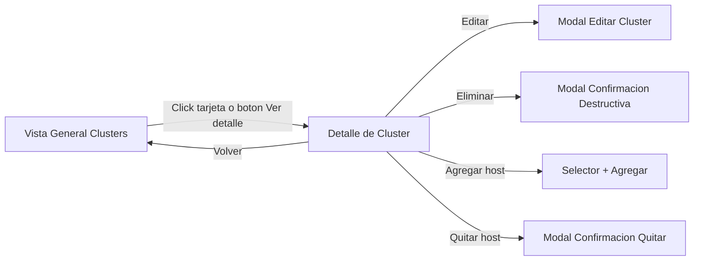

# Mockups Low-Fi (Texto) - Refactor UX/UI

Fecha: 2026-03-17

## 1. Flujo principal de clusters virtuales



## 2. Mockup - Racks fisicos (pantalla principal)

```text
+----------------------------------------------------------------------------------------------+
| Racks Fisicos                                 [Buscar....] [Filtro] [Agregar] [Actualizar]  |
| Ultima actualizacion: 17/03/2026 08:54                                                     |
+----------------------------------------------------------------------------------------------+
| [KPI Racks] [KPI Servidores] [KPI Activos] [KPI Inactivos]                                  |
+----------------------------------------------------------------------------------------------+
| [Rack 1]      [Rack 2]      [Rack 3]      [Rack 4]      [Rack 5]                             |
|  +--------- servidor block ----------+                                                       |
|  | |status|  SRVAPP01                |                                                       |
|  |         192.168.x.x / host        |                                                       |
|  +-----------------------------------+                                                       |
|  +--------- servidor block ----------+                                                       |
|  | |status|  SRVDB02                 |                                                       |
|  |         192.168.x.x / host        |                                                       |
|  +-----------------------------------+                                                       |
|                                                                                              |
|  Hover servidor -> popover: CPU, RAM, Disco, SO, last check                                 |
+----------------------------------------------------------------------------------------------+
| [Pag <] [1] [2] [3] [> Pag]    Mostrando 1-20 de 126                                        |
+----------------------------------------------------------------------------------------------+
```

## 3. Mockup - Vista general de clusters

```text
+----------------------------------------------------------------------------------------------+
| <- Volver                            Clusters Danec                                          |
+----------------------------------------------------------------------------------------------+
| +------------------------+  +------------------------+  +------------------------+          |
| | Danec Cluster 1        |  | Danec Cluster 2        |  | Danec Cluster 3        |          |
| | Hosts: 2  VMs: 12      |  | Hosts: 3  VMs: 44      |  | Hosts: 2  VMs: 23      |          |
| | Salud: OK              |  | Salud: Degradado       |  | Salud: OK              |          |
| | [Editar] [Eliminar]    |  | [Editar] [Eliminar]    |  | [Editar] [Eliminar]    |          |
| |      [Ver detalle]     |  |      [Ver detalle]     |  |      [Ver detalle]     |          |
| +------------------------+  +------------------------+  +------------------------+          |
+----------------------------------------------------------------------------------------------+
```

## 4. Mockup - Detalle de cluster

```text
+----------------------------------------------------------------------------------------------+
| <- Volver                            Danec Cluster 1                                         |
+----------------------------------------------------------------------------------------------+
| Hosts: SRVEXSI02, SRVVT06                     [Editar cluster] [Eliminar cluster]            |
| 2 hosts - 12 VMs                                                                          |
+----------------------------------------------------------------------------------------------+
| +--------------------------------------+  +--------------------------------------+          |
| | Host: SRVEXSI02        [3 VMs]       |  | Host: SRVVT06         [9 VMs]       |          |
| | estado host: activo                  |  | estado host: activo                  |          |
| | [vm1 o] [vm2 x] [vm3 o]              |  | [vmA o] [vmB o] [vmC x] ...         |          |
| +--------------------------------------+  +--------------------------------------+          |
+----------------------------------------------------------------------------------------------+
| Gestion de hosts del cluster                                                                 |
| [Selector host existente.....] [Agregar al cluster]                                          |
|                                                                                              |
| Hosts asignados                                                                              |
| +---------------------------+    +---------------------------+                               |
| | SRVEXSI02                 |    | SRVVT06                   |                               |
| | tipo: host virtual        |    | tipo: host virtual        |                               |
| | [Quitar] (destructivo)    |    | [Quitar] (destructivo)    |                               |
| +---------------------------+    +---------------------------+                               |
+----------------------------------------------------------------------------------------------+
```

## 5. Mockup - Modal confirmacion destructiva

```text
+----------------------------------------------------+
| Eliminar cluster                                   |
|----------------------------------------------------|
| Esta accion eliminara el cluster y desvinculara    |
| sus hosts asignados. Esta accion no se puede       |
| deshacer.                                          |
|                                                    |
| [Cancelar]                     [Eliminar cluster]   |
+----------------------------------------------------+
```

## 6. Mockup - Estados de feedback

```text
Loading:   [skeleton cards x 3]
Success:   [toast verde] Cambios guardados correctamente
Error:     [toast rojo] No fue posible guardar. Reintenta.
Empty:     [icono + texto] No hay hosts asignados. [Agregar host]
```

## 7. Notas de implementacion
- Hacer clic en toda la tarjeta de cluster para abrir detalle.
- Mantener boton "Ver detalle" por claridad y accesibilidad.
- Los nombres de host asignados no deben parecer botones interactivos.
- Los indicadores rojo/verde de VM deben tener diametro mayor y contraste AA.
