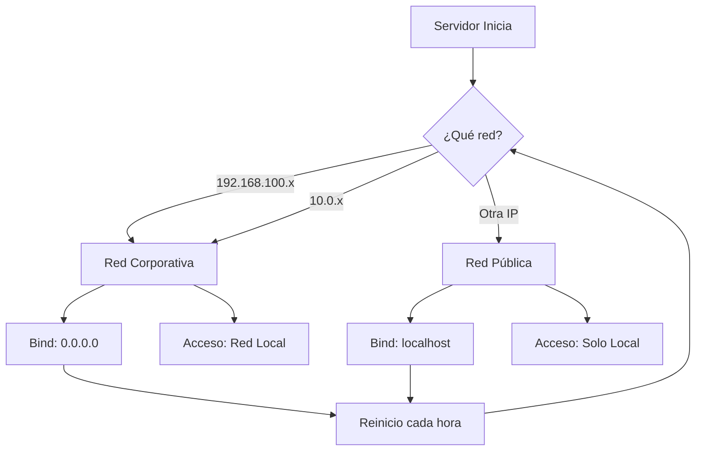

# 🔒 Resumen: Protección Contra Redes Públicas

## ❌ PROBLEMA DETECTADO

Cuando te conectas a una **red pública** (café, hotel, aeropuerto), tu servidor exponía datos sensibles:

```
TU PC en Red Pública (192.168.1.X)
       ↓
  Puerto 3050 ABIERTO
       ↓
Cualquiera puede ver:
  • IPs de servidores Grupo Danec
  • Estructura de red VMware
  • Configuraciones de hardware
  • Información confidencial
```

---

## ✅ SOLUCIÓN IMPLEMENTADA

### 🎯 Sistema de Detección Automática

El servidor **detecta el tipo de red** y ajusta su comportamiento:

#### 1️⃣ Red Corporativa (192.168.100.x, 10.0.x) → MODO ABIERTO
```bash
✅ Red Corporativa Detectada
   IP: 192.168.100.20
   Modo: Acceso en red local HABILITADO
   
🌐 Accesible en: http://192.168.100.20:3050
   Compañeros pueden acceder ✅
```

#### 2️⃣ Red Pública (otras redes) → MODO SEGURO
```bash
⚠️  Red Pública Detectada
   IP: 192.168.1.45
   Modo: SOLO LOCALHOST (seguridad activada)
   
🔒 Accesible solo en: http://localhost:3050
   Acceso remoto BLOQUEADO ❌
```

---

## 🛡️ Capas de Protección

| Capa | Descripción | Estado |
|------|-------------|---------|
| **1. Detección de Red** | Identifica red corporativa vs pública | ✅ Activo |
| **2. Binding Dinámico** | `0.0.0.0` (abierto) o `localhost` (cerrado) | ✅ Activo |
| **3. Middleware de Validación** | Bloquea IPs no autorizadas en red pública | ✅ Activo |
| **4. Auto-Restart Horario** | Re-detecta red cada hora | ✅ Activo |

---

## 🔄 Cómo Funciona



---

## 📊 Comparativa de Seguridad

| Escenario | Antes (VULNERABLE) | Ahora (PROTEGIDO) |
|-----------|-------------------|-------------------|
| **En Oficina (192.168.100.x)** | Abierto ✅ | Abierto ✅ |
| **En Casa con VPN (10.0.x)** | Abierto ✅ | Abierto ✅ |
| **Café Público (192.168.1.x)** | ⚠️ **EXPUESTO** | 🔒 **BLOQUEADO** |
| **Hotel (10.45.x.x)** | ⚠️ **EXPUESTO** | 🔒 **BLOQUEADO** |
| **Aeropuerto (172.16.x.x)** | ⚠️ **EXPUESTO** | 🔒 **BLOQUEADO** |

---

## 🎯 Archivos Creados/Modificados

### Nuevos Archivos
1. **`backend/src/services/networkSecurityService.js`** (220 líneas)
   - Detección de red
   - Validación de IPs
   - Middleware de seguridad

2. **`docs/SEGURIDAD-RED.md`** (400+ líneas)
   - Guía completa de seguridad
   - Escenarios de uso
   - Troubleshooting

3. **`check-security.ps1`** (130 líneas)
   - Script de diagnóstico
   - Verifica estado de seguridad actual

### Archivos Modificados
4. **`backend/server.js`**
   - Integración de networkSecurityService
   - Binding dinámico según red
   - Logs de seguridad mejorados

5. **`ecosystem.config.cjs`**
   - Auto-restart cada hora (`cron_restart`)

6. **`README.md`**
   - Sección de seguridad agregada
   - Links a nueva documentación

7. **`docs/INDEX.md`**
   - Referencias a SEGURIDAD-RED.md y ACCESO-RED.md

---

## 🚀 Estado Actual

### Servidor Corriendo con Protección Activa

```bash
# Estado PM2
┌────┬──────────────────────┬──────┬──────┬──────────┬──────┬──────────┐
│ id │ name                 │ mode │ ↺    │ status   │ cpu  │ memory   │
├────┼──────────────────────┼──────┼──────┼──────────┼──────┼──────────┤
│ 0  │ diagrama-servidores  │ fork │ 1    │ online   │ 0%   │ 41.5mb   │
└────┴──────────────────────┴──────┴──────┴──────────┴──────┴──────────┘

# Logs de Seguridad
✅ Red Corporativa Detectada
   IP: 192.168.100.20 (Wi-Fi)
   Modo: Acceso en red local HABILITADO

✅ Servidor iniciado en http://localhost:3050
🌐 Accesible en red local: http://192.168.100.20:3050
```

---

## 📝 Próximos Pasos

### 1. Probar el Sistema
```powershell
# Ver estado actual
powershell -ExecutionPolicy Bypass -File .\check-security.ps1

# Ver logs
cmd /c "pm2 logs diagrama-servidores --lines 20"
```

### 2. Probar Cambio de Red

**Simular red pública**:
1. Conectarte a otra red Wi-Fi (no 192.168.100.x)
2. Esperar hasta 1 hora o forzar reinicio:
   ```powershell
   cmd /c "pm2 restart diagrama-servidores"
   ```
3. Ver logs: deberías ver "Red Pública Detectada" + "SOLO LOCALHOST"

### 3. Volver a Red Corporativa
1. Conectarte a Wi-Fi de Grupo Danec (192.168.100.x)
2. Servidor se reinicia automáticamente en la próxima hora
3. Logs mostrarán "Red Corporativa Detectada"

---

## 🔍 Comandos de Verificación

```powershell
# 1. Ver tu IP actual
ipconfig | Select-String "IPv4"

# 2. Ver estado del servidor
cmd /c "pm2 status"

# 3. Ver logs de seguridad
cmd /c "pm2 logs diagrama-servidores | Select-String 'SEGURIDAD'"

# 4. Diagnóstico completo
powershell -ExecutionPolicy Bypass -File .\check-security.ps1

# 5. Forzar re-detección de red
cmd /c "pm2 restart diagrama-servidores"
```

---

## ⚙️ Configuración Avanzada

### Agregar Más Redes Confiables

Edita `backend/src/services/networkSecurityService.js`:

```javascript
this.trustedNetworks = [
  '192.168.100.', // Red corporativa principal
  '10.0.',        // VPN corporativa
  '172.16.',      // Nueva red corporativa (ejemplo)
  '192.168.50.',  // Sucursal Quito (ejemplo)
];
```

Reinicia:
```powershell
cmd /c "pm2 restart diagrama-servidores"
```

### Cambiar Frecuencia de Re-detección

Edita `ecosystem.config.cjs`:

```javascript
// Cada 30 minutos (más sensible)
cron_restart: '*/30 * * * *',

// Cada 2 horas (menos overhead)
cron_restart: '0 */2 * * *',

// Desactivar (solo manual)
// cron_restart: null,
```

---

## 📚 Documentación Relacionada

- 📘 [SEGURIDAD-RED.md](./SEGURIDAD-RED.md) - Guía completa (400+ líneas)
- 🌐 [ACCESO-RED.md](./ACCESO-RED.md) - Configuración de acceso
- ⚙️ [PM2-GUIA.md](./PM2-GUIA.md) - Gestión con PM2
- 📖 [README.md](../README.md) - Documentación principal

---

## ✅ Resumen de Protección

| ✅ Qué Está Protegido | 🔒 Cómo |
|----------------------|---------|
| **Datos de servidores** | Solo accesibles en red corporativa |
| **IPs y configuraciones** | Bloqueadas en redes públicas |
| **Estructura VMware** | No expuesta fuera de red confiable |
| **Acceso no autorizado** | Middleware rechaza IPs no permitidas |
| **Cambios de red** | Re-detecta automáticamente cada hora |

---

**🎉 Sistema de Seguridad Activo y Funcionando**

Tu servidor ahora es **inteligente**:
- 🏢 Abierto en oficina (colaboración)
- 🔒 Cerrado en cafés/hoteles (seguridad)
- 🔄 Se adapta automáticamente

---

**Fecha de implementación**: 30 de octubre de 2025  
**Desarrollador**: Equipo TI - Grupo Danec  
**Versión**: 0.2.2 (con protección de red)
